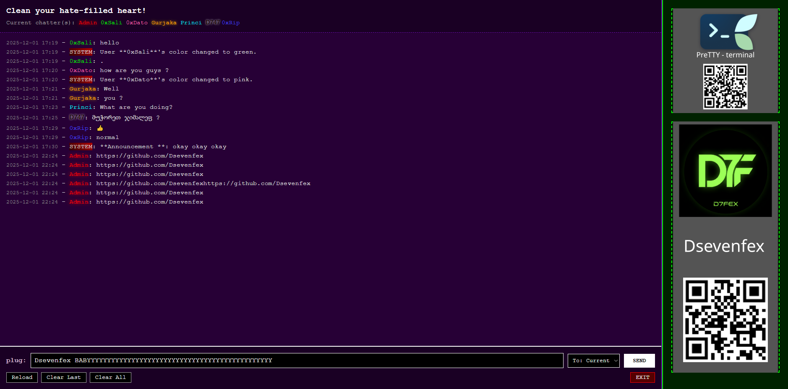

# FexChat


**FexChat** is a private, unmoderated chat system designed for secure and confidential communication. The application is designed to be used in environments where privacy is paramount and censorship is minimal. FexChat enables users to host their own servers and maintain control over the chat environment, ensuring that conversations are only visible to invited parties.

This system is built using **Flask**, **JavaScript**, **HTML**, and **CSS**, with real-time updates powered by AJAX and polling.

## Features

- **Private Chat System**: Users can host their own servers and invite trusted participants, ensuring privacy and confidentiality.
- **Custom User Colors**: Users can personalize their profile with unique chat colors. Admins and moderators can also have distinct colors.
- **Role-based Permissions**: Chat participants can have different roles, such as admin, moderator, or user. Each role comes with different levels of access and control.
- **Command-based Moderation**: Admins and moderators can control the environment with commands for muting, banning, changing colors, and more.
- **Real-time Updates**: The application uses AJAX and polling to provide live updates without needing to refresh the page.
- **Minimal Censorship**: FexChat supports freedom of expression, providing a platform with minimal restrictions.
  
## User Roles and Permissions

### **Users**
- Can send messages in the chat.
- Can change their own chat color.
  
### **Moderators**
- Can mute or unmute users.
- Can promote or demote users to/from moderator roles.
- Can manage rate limits and other system settings.
  
### **Admins**
- Full control over the chat environment.
- Can set timeouts for the chat.
- Can make public announcements.
- Can manage all users, including moderating and promoting users to higher roles.

## Available Commands

### **User Commands**
- `/color <color_name>`: Change your username's color. Only available to admins and moderators for selecting admin/mod colors.
  
### **Moderator Commands**
- `/mute <username> <minutes>`: Mute a user for a specified time (in minutes).
- `/unmute <username>`: Unmute a user.
- `/setmod <username>`: Promote a user to moderator.
- `/removemod <username>`: Remove moderator status from a user.
  
### **Admin Commands**
- `/timeout <seconds>`: Set a global timeout for the entire chat for a specified duration.
- `/clear`: Clears the chat log for the current client.
- `/say <message>`: Makes a public announcement that everyone in the chat can see.
  
## Installation

To run **FexChat** locally, follow these steps:

### Step 1: Setup Virtual Environment
Create a virtual environment for the project to manage dependencies:

```bash
python3 -m venv venv
```
### Step 2: Activate the Virtual Environment

- On Linux/macOS:
```bash
source venv/bin/activate
```
- On Windows:
```bash
python3 venv/Scripts/activate
``` 
### Step 3: Install Dependencies

Install all the required dependencies by running:
```bash
pip install -r requirements.txt
```
### Step 4: Run the Application

Start the application by running:
```bash
python app.py
```
The application will be available at: ```http://<localaddres>:<port>```

